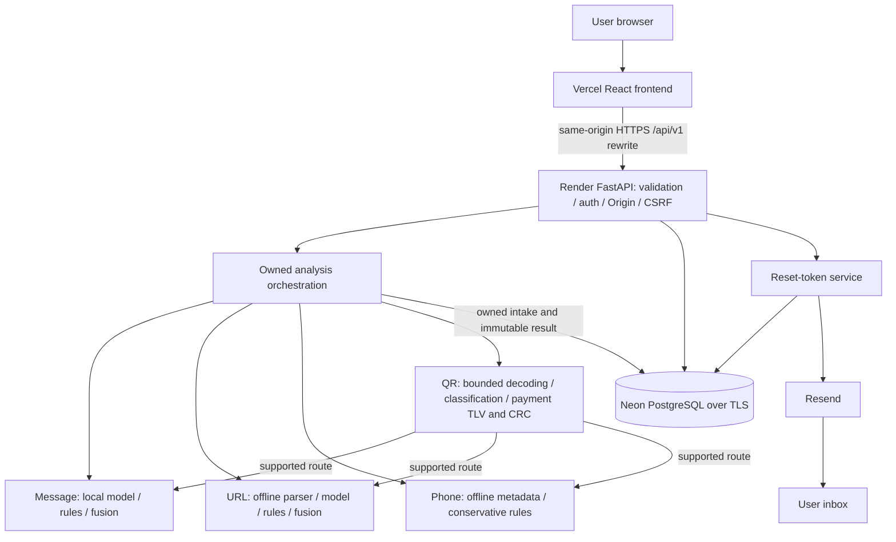

# SCAMGUARD architecture

Audited 2026-09-12. Read `PROGRESS.md` for executed verification and `DECISIONS.md` for constraints.
Tasks 1–8 are deployed; Task 9 is a review branch under feature freeze, with no new migration.
The product uses the warm-light Forensic Intelligence identity and a general international scope.



## Trust boundaries and recovery

The browser is untrusted; frontend visibility is not authorization. API ownership comes only from
the validated session, with exact Origin/CSRF protection for mutations and private search. React
renders submitted/decoded content as escaped inert text. Browser/edge, backend, database and mail
provider are separate trust boundaries. Backend secrets never enter VITE_* or source control.

Argon2id protects passwords; HttpOnly cookies carry opaque session tokens, while PostgreSQL stores
their HMAC digests. Production requires Secure, SameSite=None and exact HTTPS origins; Origin/CSRF
remains essential. Password reset uses generic responses, expiring digest-only random tokens and
locked single-use consumption, then revokes all sessions. Resend processes the reset recipient/link.
Development mail capture is environment-gated. Readiness does not prove inbox delivery.

Task 9 redacts first-field Wi-Fi passwords and embedded payment URL userinfo before new QR records
are stored. Assessment uses original bytes, so saved redacted payment text is not a reusable payment
instruction. This does not detect arbitrary secrets in free text or rewrite old production records.
Payment parsing covers a generic TLV/CRC subset, not full EMV mandatory-field compliance or merchant
identity. See [security](SECURITY_REVIEW.md), [data flows](DATA_FLOW.md), [database](DATABASE.md),
[evaluation](EVALUATION.md) and [production acceptance](PRODUCTION_ACCEPTANCE.md).

## CURRENTLY IMPLEMENTED

```text
React Router → AuthProvider → public Sign In / Sign Up / Help
                            → protected AppShell / Overview / Analyse / History / Account
  TanStack Query + Zod credentialed transport + in-memory CSRF token
    /api/v1
      FastAPI → safe request/error middleware → typed routes
        auth service → Argon2id + opaque PostgreSQL sessions + DB rate limits
        owned analysis service → local Message intelligence engine
          checksum-verified TF-IDF Logistic Regression artifact
          deterministic contextual indicators
          optional backend-only grounded external contextual review
          conservative Message-specific fusion
                                  → local offline URL intelligence engine/artifact
                                  → local offline Phone numbering/rules engine
                                  → bounded QR decoder/classifier → existing engines
        SQLAlchemy/Psycopg → PostgreSQL → Alembic 0001 … 0006
```

### Frontend

Task 8 adds a user-started MediaStream → bounded canvas → native QR detector or same-origin WASM
worker → stopped-camera inert preview → explicit `/analyses/qr/payload` path. It feeds the existing
QR engine/persistence service. No recording, frame upload or destination request occurs. Worker/WASM
assets load on demand; Help, Account and reset pages use route chunks. Identity-scoped query keys,
cache clearing and identity-only tab notifications prevent old-account UI reuse. A revision guard
rejects late restoration/profile results after identity changes.

History search is a CSRF-protected read-only JSON POST, retaining owner checks, bounded offset
pagination and repeatable-read consistency. SQL selects summaries rather than hydrating every
assessment. Dashboard counts use grouped SQL, and labelled bars link to History filters. No schema
change is required; Alembic remains `0006_qr_intelligence`. See the Task 8 document for tradeoffs.

React 19, TypeScript, Vite and Tailwind provide the responsive application. `AppShell` supplies the desktop sidebar, mobile navigation, skip link, focused route headings and titles. The design system centralizes the Forensic Intelligence tokens, short motion and `prefers-reduced-motion` behavior.

The four typed Analyse modes are Message, URL, Phone and QR. Message submits only when both storage
and intelligence are advertised. URL runs a separate offline classifier/evidence/fusion pipeline and
persists without destination access. Phone requires explicit international context, normalizes through
the shared API, and displays conservative offline numbering evidence without a numeric fraud score.
QR uploads one bounded PNG/JPEG/WebP to the authenticated backend, shows a local preview, decodes a
single symbol in memory and discards the original image. HTTP(S), phone and suitable text payloads
reuse their existing engines. EMV-style payment structure/CRC is parsed conservatively; unsupported
content remains insufficient evidence and is never executed or opened.

Overview uses only the authenticated user's database totals, flagged counts, latest time and recent
records. A flagged record has stored `ELEVATED` or `HIGH` risk. Loading, unavailable, failure and
genuine-empty states never fall back to fixtures. History retrieves owned persisted detail on demand,
allows confirmed deletion and renders submitted URLs as inert text. Help and privacy remain public.

### Backend and local Message intelligence

FastAPI owns the `/api/v1` contract, request IDs, no-store/nosniff headers, credentialed exact-origin
CORS, safe error envelopes and bounded bodies. Argon2id protects passwords. Opaque session/CSRF
secrets are HMAC-digested in PostgreSQL, sessions expire/revoke, and Origin plus synchronizer-token
checks protect state changes. SQLAlchemy sessions use explicit commits and rollback/close handling.
PostgreSQL readiness checks connectivity and required domain/identity tables; startup verifies
Message, URL, Phone and QR engine/decoder initialization.

Message processing is synchronous after durable intake. The checksum-verified JSON artifact contains a three-class word-ngram TF-IDF Logistic Regression model (`LEGITIMATE`, `SPAM`, `SCAM`); no pickle is loaded. Deterministic indicators cover urgency, threat, credentials, financial requests, impersonation, prizes, investments, job/tasks, delivery/account themes, secrecy, redirection and suspicious actions. Context rules suppress safety, education and negated examples.

Message-specific fusion keeps risk separate from confidence and returns `LOW`, `CAUTION`, `ELEVATED`, `HIGH`, or `INSUFFICIENT_EVIDENCE`. Strong local evidence has a floor. External AI cannot lower it or dominate the result; unsupported high AI signals are discarded. Short context-poor messages return insufficient evidence. Details and measured limitations are documented in `MESSAGE_INTELLIGENCE.md`.

Optional OpenAI contextual review is backend-only and disabled by default. When an administrator deliberately enables it and supplies a key, only ambiguous cases are considered. Best-effort redaction runs first, the message is treated as untrusted data, responses must match a Pydantic schema and evidence must be an exact redacted-message snippet. Provider errors become component status while local processing completes. No URL browsing or client-side key exists.

### Database and migrations

Alembic `0001_analysis_intake` creates the analyses table and constraints. Additive
`0002_message_intelligence` preserves all Task 2 rows while adding neutral result fields. Additive
`0003_auth_ownership` adds normalized users, hashed server-side sessions, hashed PostgreSQL rate
buckets and nullable `analyses.user_id`. Historical rows remain null and invisible; new application
writes always receive the authenticated user ID. User deletion cascades sessions and owned analyses.
Additive `0004_phone_intelligence` extends the input-type and per-type length checks for PHONE without
rewriting existing records. Accepted Phone drafts are stored in normalized E.164 form.
Additive `0005_auth_profile_polish` adds nullable profile fields and digest-only password reset
records. Additive `0006_qr_intelligence` extends only the analysis constraints for QR; existing rows
are not rewritten.

`AnalysisStatus` is `SUBMITTED`, `PROCESSING`, `COMPLETED`, or `FAILED`. Message and URL records
normally complete. Historical intake-only records remain submitted. The `(user_id, created_at DESC,
id DESC)` index supports private history. Dashboard totals and flagged counts are scoped by user.

### Configuration, deployment and privacy

Backend settings load from `backend/.env` with process variables taking precedence. Persistence
defaults off locally. Production requires PostgreSQL TLS, a non-default database password, a strong
auth pepper, at least one exact HTTPS CORS origin, persistence, and `Secure; SameSite=None` cookies.
Model paths and optional AI settings are environment controlled; secrets use `SecretStr` and are
never returned.

The user-verified production target is Vercel Vite → same-origin `/api/v1` CDN rewrite → Render
FastAPI → Neon PostgreSQL. Render receives secrets; Vercel uses public routing only. `render.yaml`
builds the backend and the single-instance
free-tier start script applies Alembic before Uvicorn. Message and URL artifacts are packaged JSON,
checksum-verified and never runtime-downloaded; Phone numbering metadata and the QR decoder ship in
pinned Python wheels. Task 7 adds no required environment variable or external service. See
[PRODUCTION_DEPLOYMENT.md](PRODUCTION_DEPLOYMENT.md),
[AUTHENTICATION.md](AUTHENTICATION.md), and [PRIVACY_MODEL.md](PRIVACY_MODEL.md).

## PLANNED ARCHITECTURE

Live URL reputation adapters and remote webpage inspection, Phone reputation/subscriber lookup,
general screenshot/OCR, cross-modal unified risk, community moderation,
controlled adaptive learning, campaign intelligence and Model Lab are not implemented. Suspicious
URLs must never be automatically browsed. Community reports must not directly retrain or promote a
model. Genuine metrics and held-out evaluation are required for every learned component.

## Task 6 Phone domain

The service routes PHONE to `app/phone_intelligence` through the same authenticated analysis service.
The parser pins `phonenumbers==9.0.38`, requires `+` international context, rejects hostile/ambiguous
forms, and normalizes accepted values to E.164. The engine emits only supported bundled numbering
metadata and rules-based evidence. Premium/shared-cost metadata may produce CAUTION; all other
Phone-only cases conservatively report INSUFFICIENT_EVIDENCE. There is no Phone ML classifier,
probability, provider, destination access, call/message, identity lookup or reputation adapter.
History reads stored results without re-running parsing. See `PHONE_INTELLIGENCE.md`.

Task 3 fusion applies only to Message evidence; it is not the planned cross-modal risk engine. A future queue/worker is also unselected and should be justified by measured latency or reliability needs rather than added speculatively.

## Task 4 URL domain

The service routes URL to `app/url_intelligence` and MESSAGE to the unchanged `app/ml` domain. URL parsing uses strict validation and pinned offline tldextract/IDNA; userinfo is removed before durable intake. The JSON random forest consumes 27 freshly derived local features; four detector groups produce explainable evidence. Separate `url_fusion_v1` prevents weak indicators or ML alone from producing High. An optional injectable reputation protocol defaults disabled; no network adapter exists.

Task 3 already added neutral persisted status/risk/summary/evidence/actions/component/version/completion fields, so no Task 4 schema migration is necessary. URL model/rules/fusion versions occupy the current row's audit columns; reputation and minimal analytical metadata use component JSON. No Message rows are rewritten. History reads stored results without re-running models/providers. Refer to URL_INTELLIGENCE.md for the exact parsing, privacy, no-fetch and future SSRF boundary.

## Task 7 QR domain

`POST /api/v1/analyses/qr` is a dedicated multipart route because the generic endpoint remains typed
JSON. `Pillow` validates actual raster content/dimensions and creates a metadata-free grayscale pixel
buffer; `zxing-cpp` decodes exactly one QR symbol. The payload classifier routes only supported
content into the unchanged Message, URL or Phone engine, so QR adds no independent severity. A
bounded EMV-style TLV/CRC parser reports payment integrity without asserting legitimacy.

The image exists only during request processing. PostgreSQL retains private decoded content and
derived assessment/audit metadata; URL credentials and Wi-Fi passwords are redacted first. QR rows
participate in the existing ownership, history, dashboard, deletion, account cascade and database
rate-limit paths. Read [QR Intelligence](QR_INTELLIGENCE.md) for the exact limits and limitations.

## Post-Task 4 presentation layer

The UI refinement is frontend-only. lib/resultPresentation.ts maps existing stored assessments to documented display scores and severity-ordered evidence without mutating data or rerunning fusion. ResultPresentation.tsx owns shared hero, score, confidence, evidence, actions and native metadata disclosure; MessageResult/URLResult supply the modality-specific rows. Both new submissions and history pass the real analysis ID and completion time. URL API risk_score stays null; its ordinal index exists only in presentation. No backend, API schema, model, dataset or migration changed. See [UI_UX_REFINEMENT.md](UI_UX_REFINEMENT.md).
