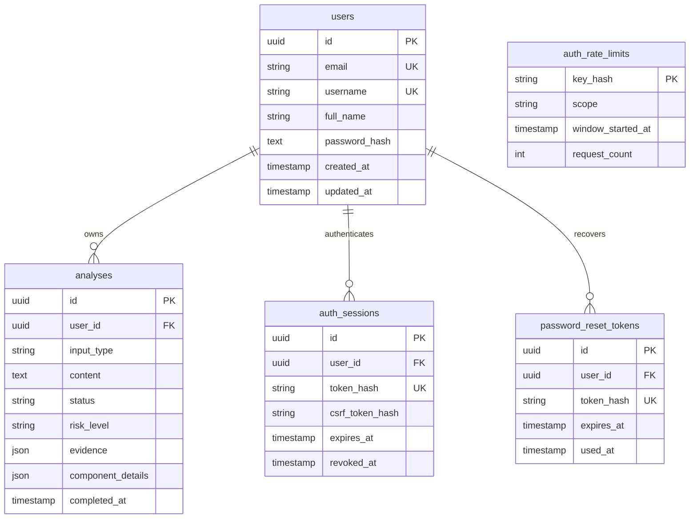

# Database design
PostgreSQL 17; SQLAlchemy 2 / Psycopg 3; explicit Alembic head `0006_qr_intelligence`.
Task 9 adds no migration. Source authority: `backend/app/db/models.py` and `backend/migrations/`.

| Table | Purpose and constraints | Sensitivity/lifecycle |
| --- | --- | --- |
| users | Normalized unique email; nullable legacy-safe normalized username with partial unique index; nullable full name; Argon2id hash. | Personal account data. Profile edits only affect the current user; email is read-only in the product. |
| analyses | MESSAGE/URL/PHONE/QR enum checks; bounded nonempty content; status, risk, separate confidence, explanations/actions/limitations, component/model/rules/fusion versions, timestamps and safe failure code. | Private decoded/text content and derived assessment. Immutable completed results. Individual deletion supported. No original QR image. |
| auth_sessions | User FK, unique HMAC token digest, CSRF digest, expiry/last-use/revocation timestamps. | Security material, never listed in normal user responses. Raw session token is not stored. |
| password_reset_tokens | User FK, unique digest, expiry/use/creation timestamps. | No raw token stored. Single use; invalidated on replacement/reset. |
| auth_rate_limits | HMAC key derived from scope/discriminator; window and count. No direct user FK. | Abuse-control state; may outlive an account. Not user analytics. |
| alembic_version | Migration bookkeeping. | Operational state; not a user-facing table. |

Users cascade to analyses, sessions and reset tokens at the database level. Legacy analyses may
have null ownership and remain invisible; no client may assign user_id. Rate buckets are not covered
by that cascade. Provider backups may retain older copies; app deletion is not a verified backup purge.

Indexes support unique account lookup, session/reset digests, expiry and descending per-user
created_at/id history. History uses bounded offset pagination and parameterized literal substring
search; broad substring/risk sorting can require scans. No new search index was added at closure.
Dashboard uses three domain SELECTs (history count, recent page, grouped type/risk distribution),
plus session authentication and occasional last-use update; there is no per-row query loop.

Migration chain: 0001 intake; 0002 Message result fields; 0003 auth/ownership; 0004 Phone;
0005 profiles/reset; 0006 QR. Disposable *_test fixtures exercise downgrade-to-base/re-upgrade,
constraints, cascades, rollback and drift. Never run destructive tests against Neon or *_dev.
