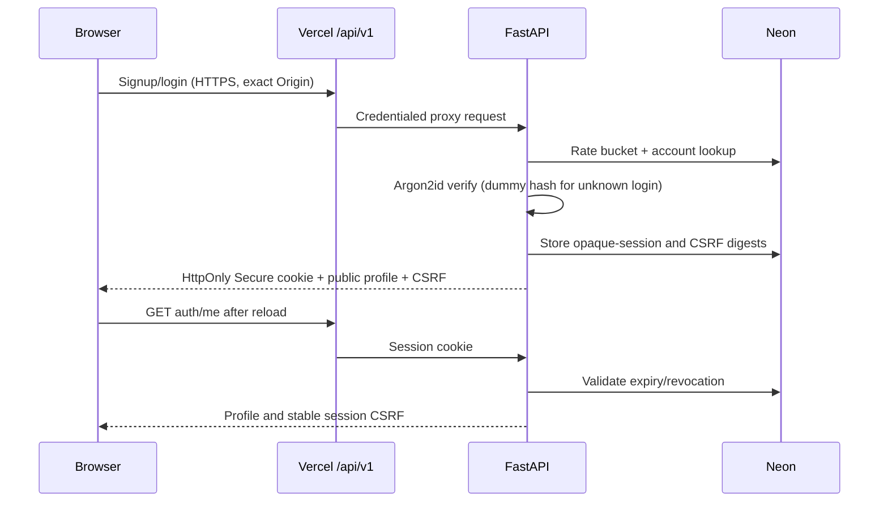
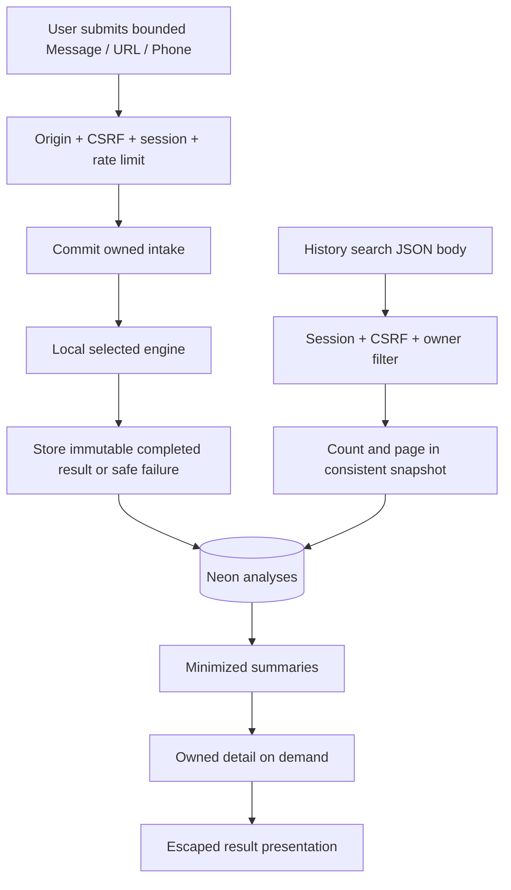
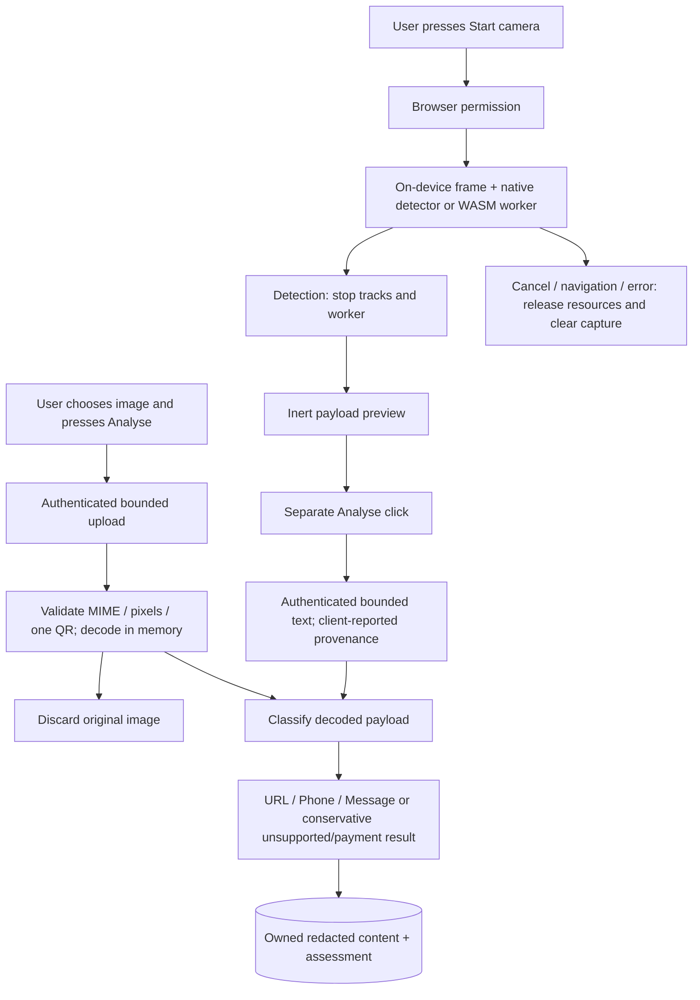

# Data flows and trust boundaries
Current source: Task 9 branch; production baseline: Task 8 merge. These diagrams describe implemented
flows. Boundaries and labels are conceptual; no unsupported background queue is implied.

## Authentication and identity

The raw session secret remains in the cookie; the CSRF token is held in frontend memory.
Identity changes clear private caches and notify other tabs without transmitting analysis content.

## Analysis and History

Analyse again copies an owned visible input into a new draft; submission creates a new ID.
There is no edit-result or foreign-content replay endpoint. QR replay requires a fresh upload/scan.
The synchronous intake/processing/completion transactions can leave an ambiguous outcome after
network loss. Check History before retrying; no idempotency key is implemented.

## QR upload and camera

No camera recording/frame upload or automatic external navigation. No QR image storage.
URL userinfo and Wi-Fi passwords are redacted; Task 9 closes additional ordering/payment cases.
Decoded text can still be sensitive; do not submit credentials or private personal content.

## Password reset
```mermaid
sequenceDiagram
  participant B as Browser
  participant A as FastAPI
  participant D as Neon
  participant M as Resend
  B->>A: Email + exact Origin
  A->>D: Rate limit + lookup; invalidate previous reset tokens
  A->>D: Store new token digest + expiry
  A->>M: Existing-account recipient + one-time URL
  A-->>B: Same 202 message for existing/unknown/provider failure
  M-->>B: Email inbox delivery (owner acceptance required)
  B->>A: Token + new password + exact Origin
  A->>D: Lock token; check expiry/use; update hash; revoke sessions
  A-->>B: 204 or generic invalid-token response
```
Resend receives the recipient and reset URL; it does not receive analysis history. Provider acceptance
is not inbox delivery. The frontend removes the token from the address bar after reading it;
avoid capturing email/reset tokens in screenshots.
