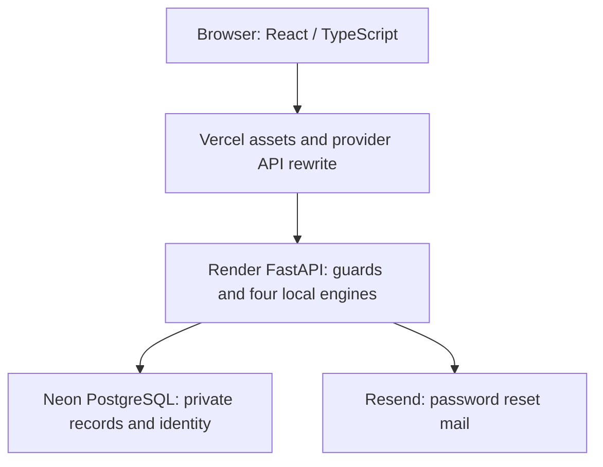
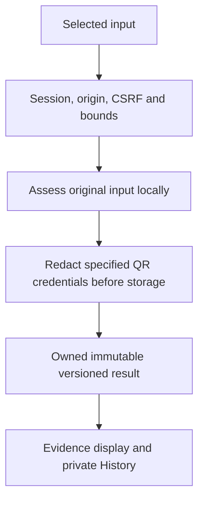
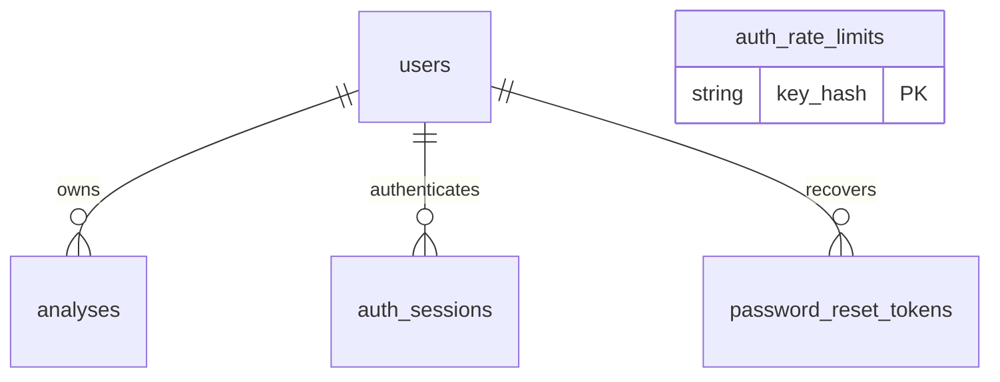
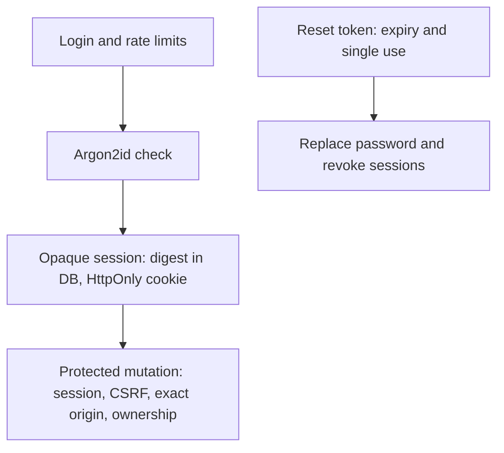
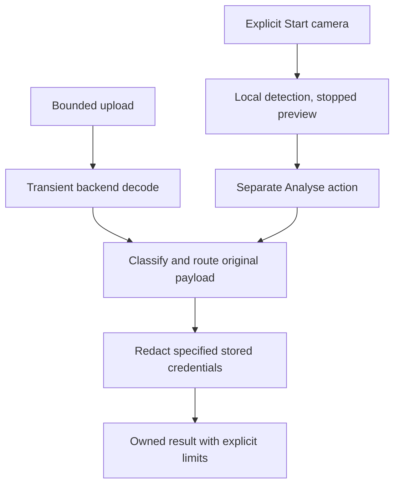

# Figure and table register

The Word report uses Figures 1–11 and Tables 1–14 in order of first appearance. Every figure/table has a caption, source and in-text reference. Word's contents and figure/table lists are refreshed from fields. PNGs are the embedded figures; SVGs preserve the editable text/vector diagrams and plots. Sources describe the final application commit `4df277bdf93a2e1424ac533d488cd7ba127b35ce`. Diagrams are authored explanatory views, not screenshots or independent measurements.

| Figure | Caption / file | Source and interpretation | Report reference |
| --- | --- | --- | --- |
| 1 | [Production architecture and service responsibilities](figures/figure-01-architecture.png) | ARCHITECTURE.md; actual Vercel provider rewrite in PRODUCTION_ACCEPTANCE.md; deployment evidence in FINAL_RELEASE.md | 3.1; scope and solution |
| 2 | [Analysis data flow and retention boundary](figures/figure-02-data-flow.png) | Analysis services and PRIVACY_MODEL.md; transient images versus saved text | 3.1; privacy discussion |
| 3 | [Selected database entities and ownership relationships](figures/figure-03-erd.png) | backend/app/db/models.py; selected fields of all five tables; rate buckets have no user FK | 3.1; Appendix A |
| 4 | [Authentication, protected access and recovery](figures/figure-04-authentication.png) | Auth API/core and reset services; recovery is a separate lifecycle | 3.1; Appendix A |
| 5 | [QR upload, camera consent and payload routing](figures/figure-05-qr-workflow.png) | QR decoder/engine/payment and cameraScanner.ts; bounds and original-versus-redacted distinction | 3.1; Appendix A |
| 6 | [Recorded Git chronology](figures/figure-06-gantt.png) | evidence/project-git-chronology.txt; dates do not establish labour duration or original deadlines | 4.2; FINAL_GANTT.md |
| 7 | [Frozen Message and URL confusion matrices](figures/figure-07-confusion-matrices.png) | Model evaluation JSON and frozen reproduction; 1,160 and 36,901 labelled test rows | B.2; FINAL_EVALUATION.md |
| 8 | [Recorded automated test counts](figures/figure-11-testing.png) | release-verification.json; 159/50/310 pass counts, separate scopes, one Pytest skip/two warnings | B.2; Tables 13–14 |
| 9 | [Message assessment with separate risk and confidence](figures/report-message.png) | Genuine local screenshot; authored OTP request; recorded environment/time below | Appendix C |
| 10 | [QR analysis after an explicit upload submission](figures/report-qr-result.png) | Genuine local screenshot; generated example.com QR produced Caution; not an invented safe verdict | Appendix C |
| 11 | [Private History with search, type and risk filters](figures/report-history.png) | Genuine local screenshot; records belong to the synthetic capture account | Appendix C |

Additional actual local screenshots: [login](figures/report-login.png), [URL](figures/report-url.png), [Phone](figures/report-phone.png), [QR upload](figures/report-qr-upload.png), [dashboard](figures/report-dashboard.png), [account](figures/report-account.png). They form the offline demonstration support set and are explicitly referenced here, rather than orphaned assets.

Screenshot provenance: [report-screenshots.json](evidence/report-screenshots.json). Captured 12 September 2026 using Chrome 152.0.7977.76, 1440 × 1000 viewport, unchanged application source at the release SHA, a real isolated local PostgreSQL `_e2e` database and a synthetic account. No production requests, real credentials, inbox or physical camera were used. There were no uncaught page errors during the successful capture. The first URL capture attempt failed because the capture script used the wrong button label; the corrected capture succeeded. This was not an application defect or a rerun of the release verification suite.

| Table | Content | Companion with full requested audit columns |
| --- | --- | --- |
| 1 | Four SMART objectives | FINAL_SMART_OBJECTIVES.md |
| 2 | Objective evidence traceability | FINAL_SMART_OBJECTIVES.md |
| 3 | Fifteen deliverables/contributions | FINAL_SCOPE_DELIVERABLES.md |
| 4 | Related-system critical comparison | RELATED_SYSTEM_COMPARISON.md |
| 5 | Capability evidence and unknowns | RELATED_SYSTEM_COMPARISON.md |
| 6 | Eighteen functional requirements | REQUIREMENTS.md |
| 7 | Ten non-functional requirements | REQUIREMENTS.md |
| 8 | Seventeen software groups and reasons | SOFTWARE_HARDWARE_REQUIREMENTS.md |
| 9 | Seven hardware/environment roles | SOFTWARE_HARDWARE_REQUIREMENTS.md |
| 10 | Twelve recorded phases/milestones | PROJECT_PLAN.md |
| 11 | Gantt table equivalent | FINAL_GANTT.md |
| 12 | Eighteen risks/mitigations/contingencies | FINAL_RISK_REGISTER.md |
| 13 | Final release checks | FINAL_EVALUATION.md |
| 14 | Intelligence/performance/human evidence | FINAL_EVALUATION.md |

The report reflows wide matrices into portrait columns with labelled dimensions rather than shrinking the required type. Full requested column headings remain in the Markdown companions. No invented screenshots, volunteers, error rates or planning dates are used. The source template's example tables and style instructions have been replaced with the actual report; the source file remains unchanged.

## Diagram source equivalents

Figure 1 has the following reviewable topology. Read arrows as request/data dependencies, not measured traffic or an asynchronous queue.

Figure 2 distinguishes assessment from stored content.

Figure 3's complete schema source is `backend/app/db/models.py`; the diagram intentionally abbreviates fields.

Figure 4's separate recovery path must not be mistaken for an automatic login transition.

Figure 5 makes both consent boundaries visible.

The Mermaid Gantt and dated table are in [FINAL_GANTT.md](FINAL_GANTT.md). The chart/diagram generator and report builder are retained under `docs/scripts/academic/` for reproducibility; they only author documentation artifacts.
