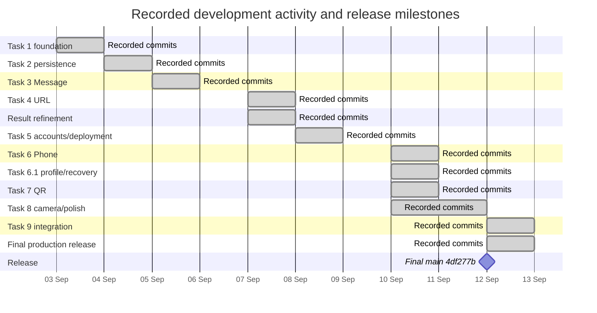

# Gantt chart and table equivalent

The chart represents recorded commit intervals from Table 10, not retrospective invented deadlines. Single-day entries use a one-day visual cell; zero-duration release is a milestone. Dates are 2026, Asia/Kuala_Lumpur. Bar endpoints are the dates printed in Table 10; they do not establish exact working hours.

**Figure 6. Recorded development chronology.** Source: Git commit timestamps; see PROJECT_PLAN.md and evidence/project-git-chronology.txt.

**Table 11. Report-friendly Gantt equivalent.** An X indicates a calendar date within the recorded interval, including its endpoints; a dash indicates no inference.

| Phase | Sep 03 | Sep 04 | Sep 05 | Sep 06 | Sep 07 | Sep 08 | Sep 09 | Sep 10 | Sep 11 | Sep 12 |
| --- | --- | --- | --- | --- | --- | --- | --- | --- | --- | --- |
| Task 1 foundation | X | X | - | - | - | - | - | - | - | - |
| Task 2 persistence | - | X | X | - | - | - | - | - | - | - |
| Task 3 Message | - | - | X | - | - | - | - | - | - | - |
| Task 4 URL | - | - | - | - | X | - | - | - | - | - |
| Result refinement | - | - | - | - | X | - | - | - | - | - |
| Task 5 accounts/deployment | - | - | - | - | - | X | X | - | - | - |
| Task 6 Phone | - | - | - | - | - | - | - | X | - | - |
| Task 6.1 profile/recovery | - | - | - | - | - | - | - | X | - | - |
| Task 7 QR | - | - | - | - | - | - | - | X | - | - |
| Task 8 camera/polish | - | - | - | - | - | - | - | X | X | X |
| Task 9 integration | - | - | - | - | - | - | - | - | - | X |
| Final production release | - | - | - | - | - | - | - | - | - | X |

The original literature/approval schedule, volunteer study, presentation and submission deadlines are NOT YET EVIDENCED and are explicitly listed in PROJECT_PLAN.md. They are omitted from dated bars because drawing them would invent dates. MANUAL ACTION REQUIRED: supply the approved calendar, then add these rows with evidence and distinguish planned from actual dates.
