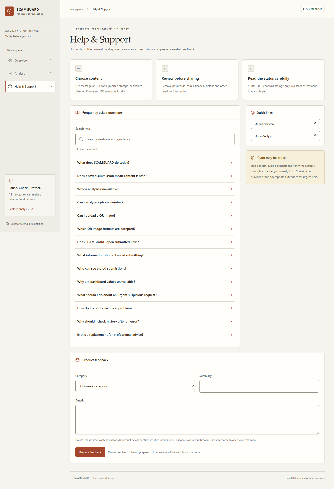
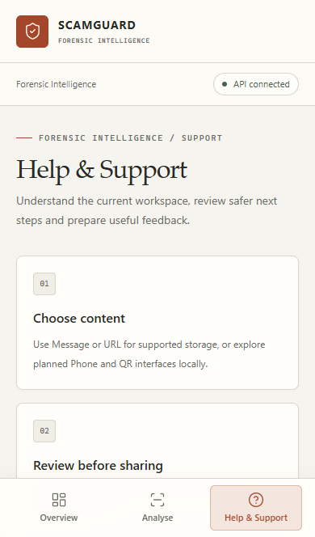
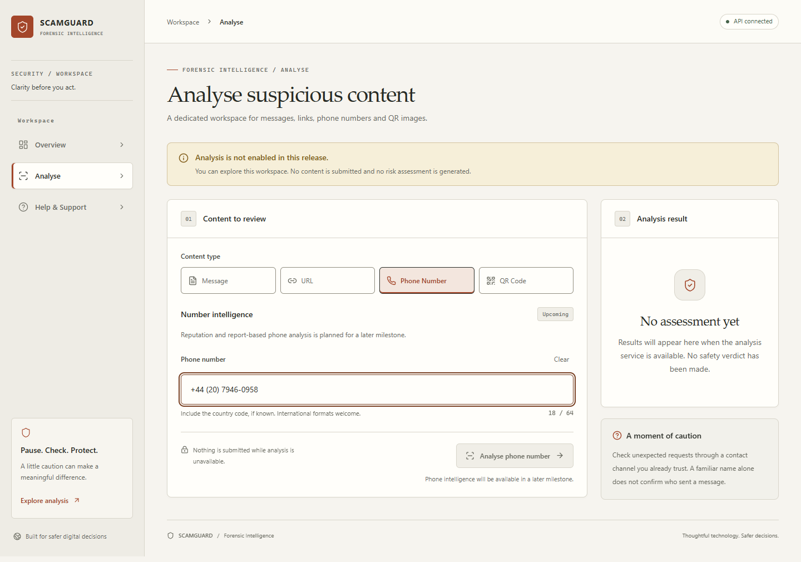
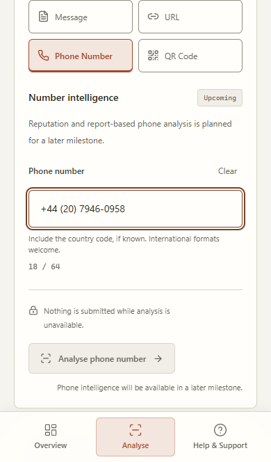
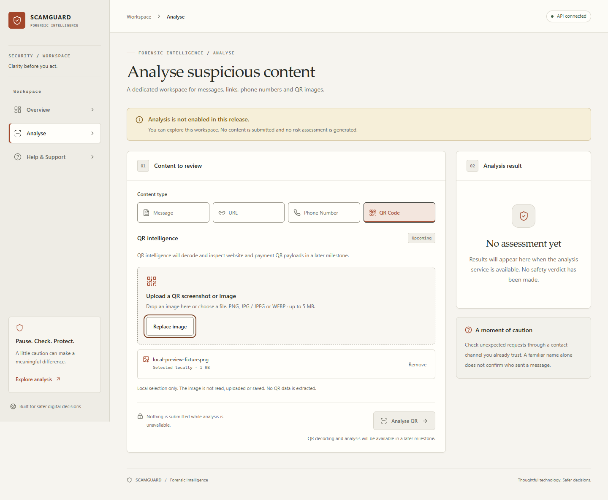
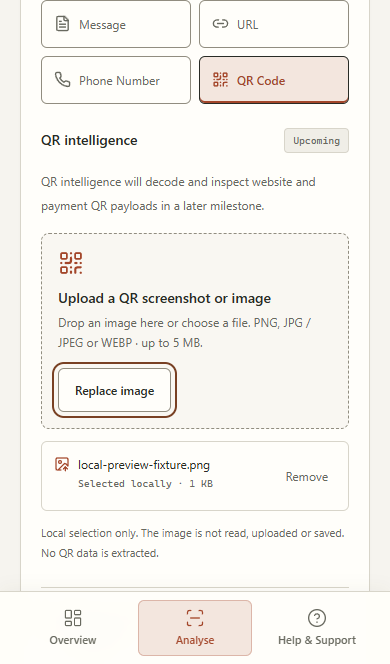

# Forensic Intelligence screenshots

Captured from the running Task 1 application with real FastAPI responses. Unavailable metrics and analysis notices are the actual release state; no demo records or fabricated analytics are used.

## Overview — desktop

## Overview — mobile

## Analyse — desktop

## Analyse — mobile

Screenshots are captured at CSS-pixel scale. Desktop uses a 1440px-wide Chrome viewport and full-page capture. Mobile uses a 390px-wide Chromium viewport capture (Phone/QR scroll to the controls), so its fixed bottom navigation appears in its actual screen position. Additional full-page mobile captures and focus evidence are inspected from the ignored Playwright output folder. These ten foundation images are deliberate documentation assets and were refreshed on 2026-09-05. The Phone draft and QR filename/metadata are explicit local test fixtures, not intelligence or analysis results. No file bytes are read or uploaded. See the README for the opt-in screenshot regeneration command.

## Help & Support — desktop / mobile

## Phone UI — desktop / mobile

## QR UI — desktop / mobile

## Task 2 — real persistence in an isolated test database

Captured 2026-09-04 with the generalized SCAMGUARD brand and unchanged Forensic Intelligence design. These are **controlled E2E test submissions**, genuinely saved in a dedicated PostgreSQL *_e2e database. Counts/UUIDs/times reflect that disposable test dataset, not production users or completed scam assessments. SUBMITTED is intake only; flagged/risk remain unavailable. The foundation captures above show persistence-disabled states; Task 2 adds these four views. Mobile views are scrolled to the relevant success/history section; full-page QA output stays ignored.

| View | Desktop | Mobile |
| --- | --- | --- |
| Saved Message acknowledgement | [Desktop](screenshots/task2-recorded-desktop.png) | [Mobile](screenshots/task2-recorded-mobile.png) |
| Real submission history | [Desktop](screenshots/task2-history-desktop.png) | [Mobile](screenshots/task2-history-mobile.png) |

Regenerate with UPDATE_DOC_SCREENSHOTS=1 and npm run test:persistence using E2E_DATABASE_URL. No production data is seeded. Screenshots are reviewed for layout/focus, not used as pixel-perfect golden tests.
