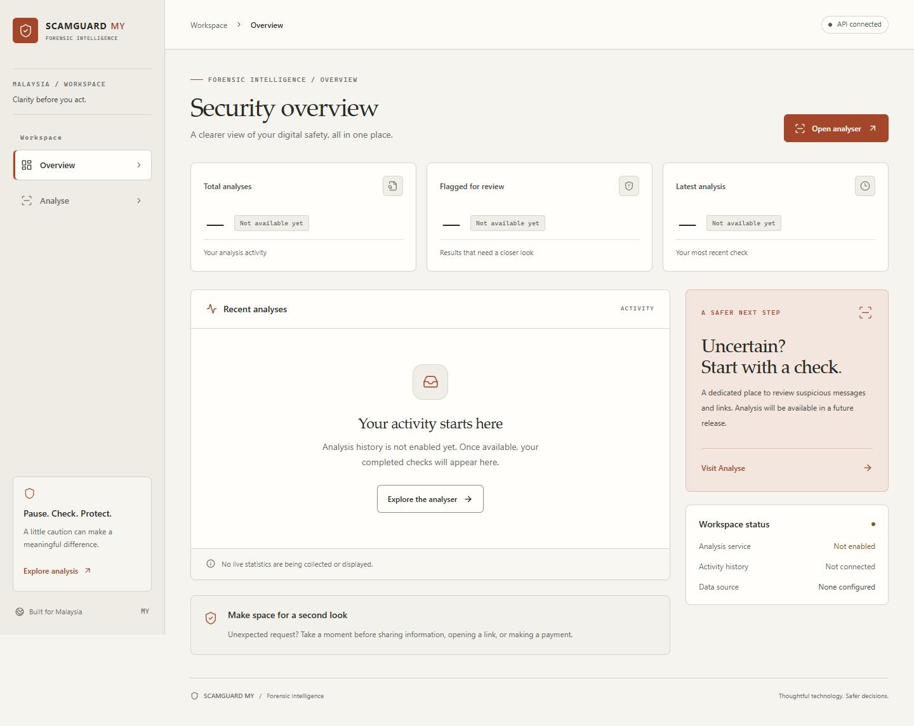
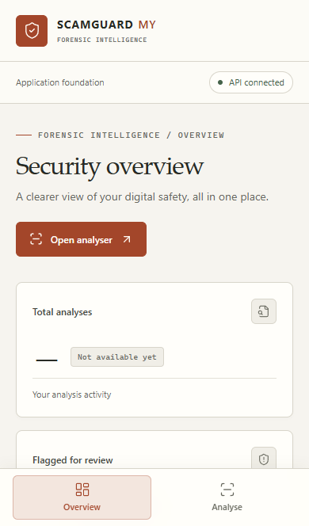
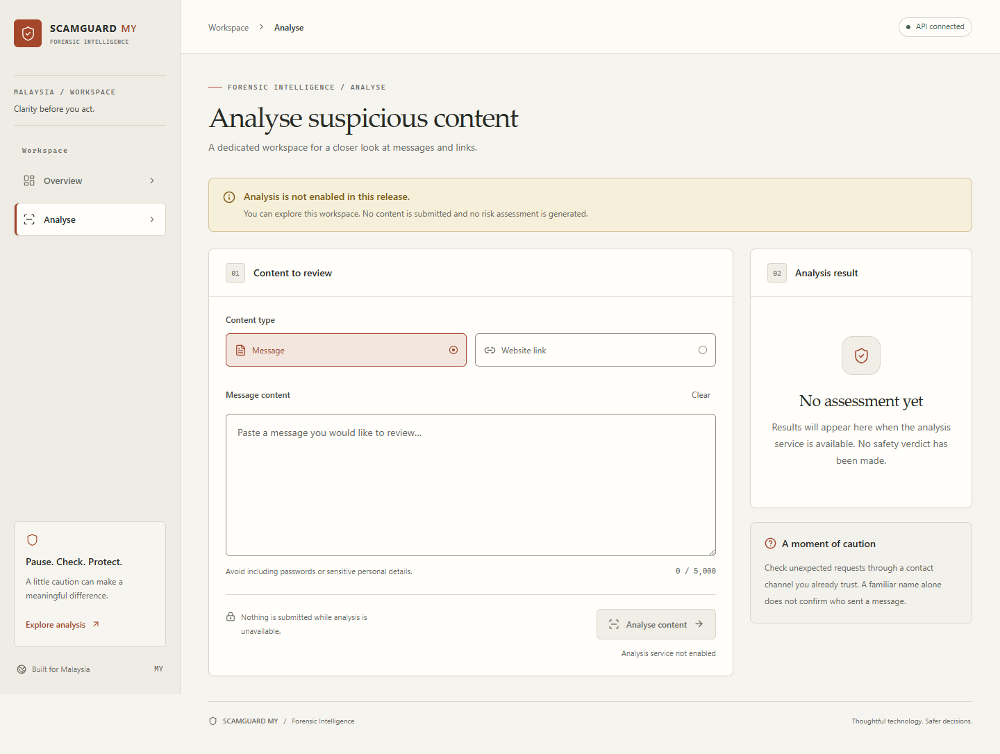
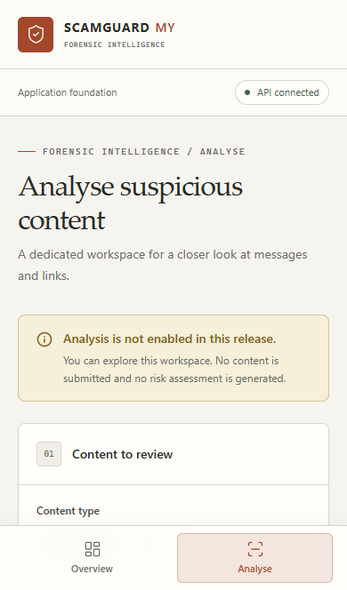

# Forensic Intelligence screenshots

Captured from the running Task 1 application with real FastAPI responses. Unavailable metrics and analysis notices are the actual release state; no demo records or fabricated analytics are used.

## Overview — desktop

## Overview — mobile

## Analyse — desktop

## Analyse — mobile

Screenshots are captured at CSS-pixel scale. Desktop uses a 1440px-wide Chrome viewport and full-page capture. Mobile uses a 390px-wide Chromium viewport capture, so its fixed bottom navigation appears in its actual screen position. Additional full-page mobile captures and focus evidence are inspected from the ignored Playwright output folder. These four images are deliberate documentation assets. See the README for the opt-in screenshot regeneration command.
